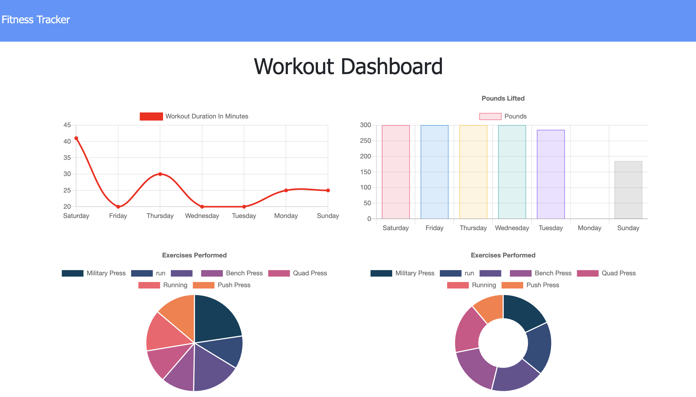
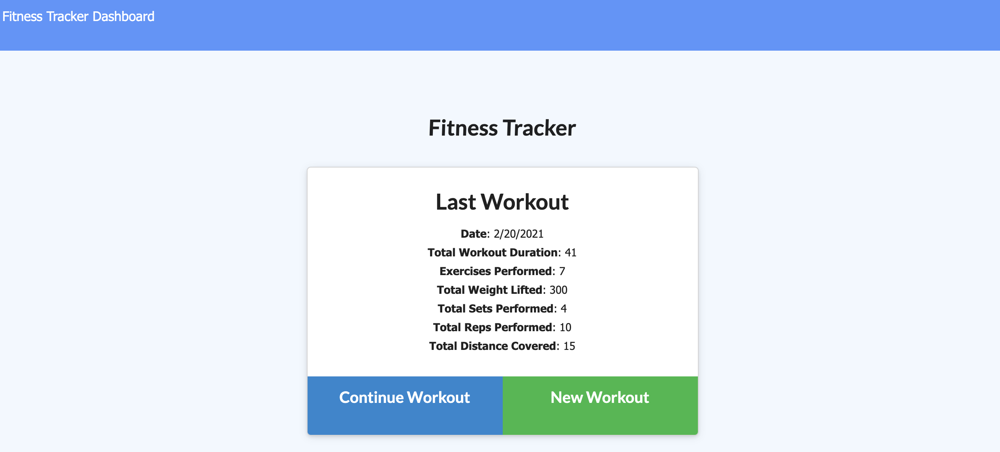
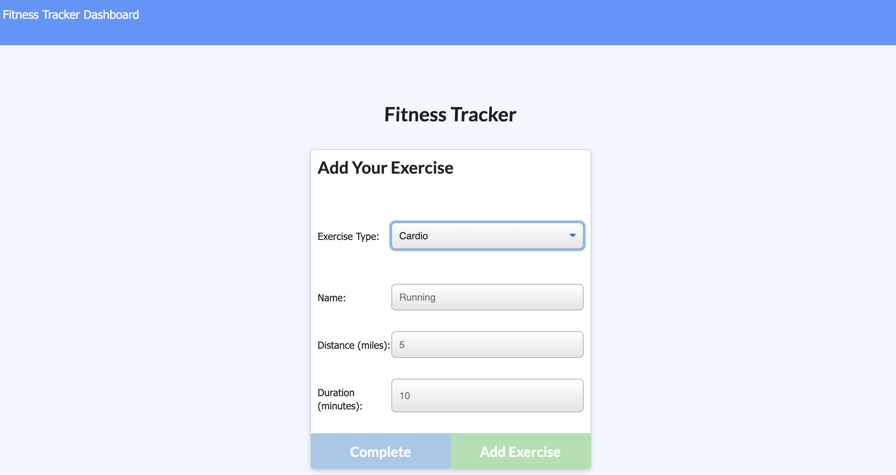

# NoSQL-Workout-Tracker

  
  
  
  

 

## Table of Contents

- [Description](*description)
- [Usage](*usage)
- [Liscense](*liscense)

 

## Description

This NoSQL based workout tracker is made for users to create their own workouts and track them daily. Users can add multiple different types of exercises to a workout and continue any workouts that were previously created. The workout dashboard will show user stats over the past seven workouts.

 

## Usage

 
After launching the webpage users can start by creating a new workout by clicking the green "New Workout" button. If a workout has already been created users can pick up where they left off by clicking the blue "Continue Workout" button.

 

Adding a new workout will take you to the exercise creation page. Choose between resistence and cardio workouts with sectoins that let you name the type of cardio or resistence related exercise being preformed. User may also choose distance if applicable, and the overall duration of newly created excercise. These workouts will then be reflected within the user dashboard to the top left of the screen.

 

 

## License

[MIT](https://choosealicense.com/licenses/mit/#)
